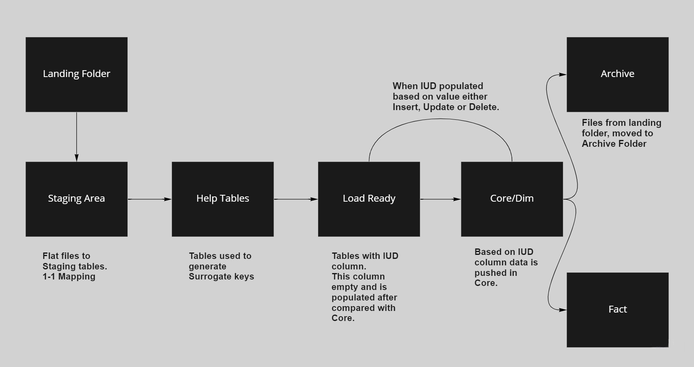
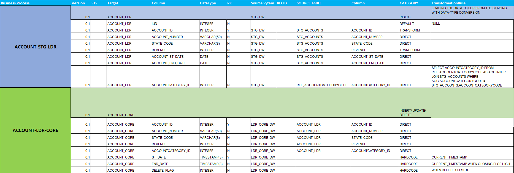
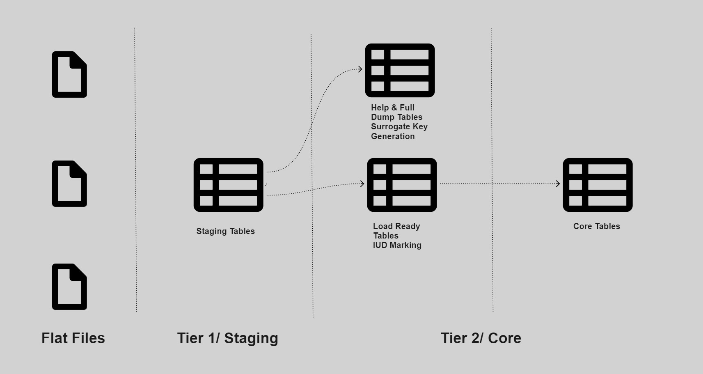

# ETL-ELT-Talend 

Teradata and Talend Open Studio were used together for this ETL project.

---

### Table of Contents

- [Overview](#overview)
- [Talend Open Studio](#talend-open-studio)
- [Program Flow](#program-flow)
- [Architecture and Design](#architecture-and-design)
- [Data Model](#data-model)
- [SMX Document](#smx-document)
- [ETL Jobs](#etl-jobs)
- [Indexes and Statistics Collection](#indexes-and-statistics-collection)
- [Tools and Technologies](#tools-and-technologies)

---

### Overview

- This project showed how Talend Open Studio can be used to load to Teradata and how we can use different indexes, statistics collection to provide value to end user. 
- Data model for the banking industry was designed. 
- ETL pipeline using Talend was designed so that the task can be automated and data can be loaded with minimum manual effort.
- The program waits for the files to land in a certain folder and then the whole process starts and in the end the data is in tables and the files are moved to archive folder.

---

### Talend Open Studio

- Download the free version of Talend Open Studio V7.3.1.
- Installed Teradata required jars so that Talend can connect to Teradata. These jars can be downloaded from Teradata websites.
  - tdgssconfig.jar
  - terajdbc4.jar
- Talend provides a great UI, pre build components that can be used for different use cases.
- Talend being a java based tool you will need to have all the java requirements checked jvm, jdk.
- While running jobs it also provides real time statistics.

---

### Program Flow

  

---

### Architecture and Design

- Now on to the interesting part. Firstly we needed to create a **Landing Zone** where our data files will be placed. This process was automated and Talend will wait for the files to appear and then will start the next processes. 
- In Talend we needed to provide our file schema in the metadata section.So, that it know what will be the format of the different files.
- Now will load the flat file to our **Staging Area/Staging Tables**.
  - Truncate and Load will happen. If any data exists that will be removed first and new data will be loaded.
  - The Staging Area is the first place where our data is loaded.
- When the data is in our Staging Area it is not in its purest form, from here do some transformations and load this data to our **Help Tables** which will be used to generate the surrogate keys, these are the keys used internally by the warehouse.
- The data from Staging Table and Help Table will be joined and loaded to the **Load Ready Tables**. 
  - These Load Ready Tables will have an extra column named as IUD (Insert, Update, Delete).
  - Based on the value in the column we will perform the operation and load to Core/Dim Tables.
  - The IUD marking will be empty for now.
- Now the **Load Ready Tables** will be checked with the respective **Core/Dim Tables** and the IUD marking will be performed. 
  - Suppose we have a table with 2 column id and address. 
  - Lets take an example, Id value 1 does not exist in Core Table but exists in Load Ready Table, in Load ready this will be marked as I (Insert).
  - The Id 1 exists in both Load Ready Table and Core Table but lets say the address of the person changed so it will be marked as U (Update). Now update type can be of SCD-1, 2 or 3 this depends on the use case.
  - The Id 1 exists in Core table but is not present in Load Ready Table, in this case it will be marked as D (Delete). This will be soft delete.
- In our Core tables we will be implementing SCDs, now that will be based on our use case.
- In Core tables will do the indexing so that based on keys we can find data efficiently and similarly will collect statistics as well. Teradata also provides us with different join indexes which are really helpful in the Fact and Dim situation.

---

### Data Model

  

- The source system provides the Full Dump (all of the data every time).
- The Transactions table is append only data.
- Most of the tables in Core/Dim are SCD Type 1 or Type 2.
- Country and City do not change much they can be loaded manually whenever needed.

---

### SMX Document

  

- An excel sheet was also created which explains what operations performed.
- Each of the table will have a detailed sheet which tells what tranformations happened, at what layer(Staging, Load Ready, Core/Dim).
- This is really helpful for other team members to see and interpret what happened.

---

### ETL Jobs

- The first time the user will place the files in the Landing area and Talend will start the job.
- It will truncate all the data if any in the Staging Tables (Contact, Account, Transaction etc) and will load this new data into the respective tables.
- After this we will populate our Help Tables with the Surogate keys and will be used in the next layers.
- Will move our data to the Load Ready Tables that have the IUD marking.
- Once the data is in the Load Ready, based on the IUD column marking we will load this data into our Core tables.
- The Core tables will have the SCDs implemented and based on that either the rows will be updated or new row will be inserted.
- Statistics will collected on these tables and indexed will be created so that data can be used efficiently by end user.
- The data file in our Landing area will be archived.
- Next day again new data arrives and this cycle will start again.

  

---

### Indexes and Statistics Collection

- Teradata provides many types of indexes
  - Unique Primary Index (UPI)
  - Non Unique Primary Index (NUPI)
  - Secondary Index (SI)
  - Non Unique Secondary Index (NUSI)

- Teradata also provides Join Indexes the result of these are stored and if any changes will be reflected in these join indexed as well
  - Single Table Join Index
  - Multiple Table Join Index
  - Aggregated Join Index

- After the data is loaded in the Core/Dim Tables we collect Statistics as well on different columns and the optimizer creates an execution strategy that is based on these statistics.

---
### Tools and Technologies

- Teradata 16.20
- Talend V7.3.1
- Java
- SqlDBM
- Excel
